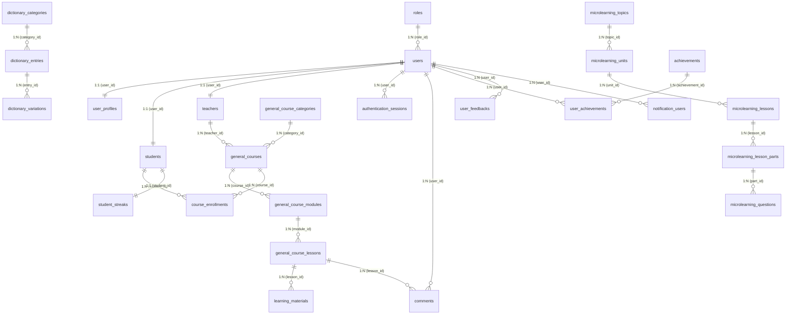

# BÁO CÁO ĐẶC TẢ LƯỢC ĐỒ CƠ SỞ DỮ LIỆU (ERD)
**Dự án**: Nền tảng Học Ngôn Ngữ Ký Hiệu (Sign Language Learning Platform)
**Ngôn ngữ DB**: PostgreSQL
**Trạng thái**: Đã cập nhật 100% đầy đủ (Bao gồm Soft-Delete và Tracking `updated_at`)

---

## 1. SƠ ĐỒ THỰC THỂ LIÊN KẾT (TỔNG QUAN)

Dưới đây là sơ đồ Mermaid thể hiện mối quan hệ giữa tất cả 26 bảng trong hệ thống:

---

## 2. CHI TIẾT CÁC BẢNG & THUỘC TÍNH LUẬN LÝ

### MODULE 1: QUẢN LÝ NGƯỜI DÙNG & XÁC THỰC

#### Bảng `roles` (Vai trò hệ thống)
| Cột | Kiểu Dữ Liệu | Khóa | Ràng buộc | Mặc định |
| :--- | :--- | :--- | :--- | :--- |
| `role_id` | INTEGER | **PK** | NOT NULL, IDENTITY | Auto Increment |
| `role_name` | VARCHAR(50) | | NOT NULL, **UNIQUE** | |

#### Bảng `users` (Tài khoản người dùng lõi)
| Cột | Kiểu Dữ Liệu | Khóa | Ràng buộc | Mặc định |
| :--- | :--- | :--- | :--- | :--- |
| `user_id` | UUID | **PK** | NOT NULL | `gen_random_uuid()` |
| `username` | VARCHAR(50) | | NOT NULL, **UNIQUE** | |
| `password_hash` | VARCHAR(255) | | NOT NULL | |
| `email` | VARCHAR(100) | | **UNIQUE** | |
| `role_id` | INTEGER | **FK** | Tới `roles(role_id)` (RESTRICT) | |
| `created_at` | TIMESTAMPTZ | | NOT NULL | `CURRENT_TIMESTAMP` |
| `updated_at` | TIMESTAMPTZ | | NOT NULL | `CURRENT_TIMESTAMP` |
| `is_deleted` | BOOLEAN | | NOT NULL | `FALSE` |

#### Bảng `user_profiles` (Hồ sơ người dùng)
| Cột | Kiểu Dữ Liệu | Khóa | Ràng buộc | Mặc định |
| :--- | :--- | :--- | :--- | :--- |
| `profile_id` | UUID | **PK** | NOT NULL | `gen_random_uuid()` |
| `user_id` | UUID | **FK** | **UNIQUE**, Tới `users(user_id)` (CASCADE) | |
| `full_name` | VARCHAR(100) | | NOT NULL | |
| `avatar_url` | VARCHAR(255) | | | |
| `phone_number` | VARCHAR(20) | | | |
| `date_of_birth` | DATE | | | |

#### Bảng `students` (Nghiệp vụ Học viên)
| Cột | Kiểu Dữ Liệu | Khóa | Ràng buộc | Mặc định |
| :--- | :--- | :--- | :--- | :--- |
| `user_id` | UUID | **PK/FK** | Tới `users(user_id)` (CASCADE) | |
| `grade_level` | VARCHAR(50) | | | |
| `school_name` | VARCHAR(150) | | | |

#### Bảng `teachers` (Nghiệp vụ Giáo viên)
| Cột | Kiểu Dữ Liệu | Khóa | Ràng buộc | Mặc định |
| :--- | :--- | :--- | :--- | :--- |
| `user_id` | UUID | **PK/FK** | Tới `users(user_id)` (CASCADE) | |
| `bio` | TEXT | | | |
| `department` | VARCHAR(100) | | | |

#### Bảng `authentication_sessions` (Quản lý phiên đăng nhập)
*Ràng buộc bổ sung: `CHECK (expires_at > created_at)`*
| Cột | Kiểu Dữ Liệu | Khóa | Ràng buộc | Mặc định |
| :--- | :--- | :--- | :--- | :--- |
| `session_id` | UUID | **PK** | NOT NULL | `gen_random_uuid()` |
| `user_id` | UUID | **FK** | Tới `users(user_id)` (CASCADE) | |
| `session_key` | VARCHAR(255) | | NOT NULL, **UNIQUE** | |
| `otp_code` | VARCHAR(10) | | | |
| `expires_at` | TIMESTAMPTZ | | NOT NULL | |
| `created_at` | TIMESTAMPTZ | | NOT NULL | `CURRENT_TIMESTAMP` |

---

### MODULE 2: TỪ ĐIỂN NGÔN NGỮ KÝ HIỆU

#### Bảng `dictionary_categories` (Chủ đề từ vựng)
| Cột | Kiểu Dữ Liệu | Khóa | Ràng buộc | Mặc định |
| :--- | :--- | :--- | :--- | :--- |
| `category_id` | INTEGER | **PK** | NOT NULL, IDENTITY | Auto Increment |
| `name` | VARCHAR(100) | | NOT NULL, **UNIQUE** | |
| `description` | TEXT | | | |

#### Bảng `dictionary_entries` (Kho từ vựng)
*Ràng buộc bổ sung: `UNIQUE (category_id, word)` - 1 từ không trùng trong 1 chủ đề*
| Cột | Kiểu Dữ Liệu | Khóa | Ràng buộc | Mặc định |
| :--- | :--- | :--- | :--- | :--- |
| `entry_id` | UUID | **PK** | NOT NULL | `gen_random_uuid()` |
| `category_id` | INTEGER | **FK** | Tới `dictionary_categories` (RESTRICT) | |
| `word` | VARCHAR(100) | | NOT NULL | |
| `meaning` | TEXT | | NOT NULL | |
| `updated_at` | TIMESTAMPTZ | | NOT NULL | `CURRENT_TIMESTAMP` |
| `is_deleted` | BOOLEAN | | NOT NULL | `FALSE` |

#### Bảng `dictionary_variations` (Biến thể từ vựng theo vùng miền)
*Ràng buộc bổ sung: `UNIQUE (entry_id, video_url)`*
| Cột | Kiểu Dữ Liệu | Khóa | Ràng buộc | Mặc định |
| :--- | :--- | :--- | :--- | :--- |
| `variation_id` | UUID | **PK** | NOT NULL | `gen_random_uuid()` |
| `entry_id` | UUID | **FK** | Tới `dictionary_entries` (CASCADE) | |
| `region` | VARCHAR(100) | | | |
| `video_url` | VARCHAR(255) | | NOT NULL | |
| `description` | TEXT | | | |

---

### MODULE 3: KHÓA HỌC TỔNG QUÁT LỘ TRÌNH (GENERAL COURSES)

#### Bảng `general_course_categories` (Danh mục khóa học)
| Cột | Kiểu Dữ Liệu | Khóa | Ràng buộc | Mặc định |
| :--- | :--- | :--- | :--- | :--- |
| `category_id` | INTEGER | **PK** | NOT NULL, IDENTITY | Auto Increment |
| `name` | VARCHAR(100) | | NOT NULL, **UNIQUE** | |

#### Bảng `general_courses` (Hồ sơ Khóa học)
*Ràng buộc bổ sung: `CHECK (visibility_status IN ('DRAFT', 'PUBLISHED', 'ARCHIVED'))`*
| Cột | Kiểu Dữ Liệu | Khóa | Ràng buộc | Mặc định |
| :--- | :--- | :--- | :--- | :--- |
| `course_id` | UUID | **PK** | NOT NULL | `gen_random_uuid()` |
| `teacher_id` | UUID | **FK** | Tới `teachers` (RESTRICT) | |
| `category_id` | INTEGER | **FK** | Tới `course_categories` (RESTRICT) | |
| `title` | VARCHAR(255) | | NOT NULL | |
| `description` | TEXT | | | |
| `visibility_status`| VARCHAR(20) | | NOT NULL | `'DRAFT'` |
| `updated_at` | TIMESTAMPTZ | | NOT NULL | `CURRENT_TIMESTAMP` |
| `is_deleted` | BOOLEAN | | NOT NULL | `FALSE` |

#### Bảng `general_course_modules` (Chương cấu trúc khóa)
*Ràng buộc bổ sung: `UNIQUE (course_id, order_index)` và `CHECK (order_index > 0)`*
| Cột | Kiểu Dữ Liệu | Khóa | Ràng buộc | Mặc định |
| :--- | :--- | :--- | :--- | :--- |
| `module_id` | UUID | **PK** | NOT NULL | `gen_random_uuid()` |
| `course_id` | UUID | **FK** | Tới `general_courses` (CASCADE) | |
| `title` | VARCHAR(255) | | NOT NULL | |
| `order_index` | INTEGER | | NOT NULL | |

#### Bảng `general_course_lessons` (Bài học trong chương)
*Ràng buộc bổ sung: `UNIQUE (module_id, order_index)` và `CHECK (order_index > 0)`*
| Cột | Kiểu Dữ Liệu | Khóa | Ràng buộc | Mặc định |
| :--- | :--- | :--- | :--- | :--- |
| `lesson_id` | UUID | **PK** | NOT NULL | `gen_random_uuid()` |
| `module_id` | UUID | **FK** | Tới `modules` (CASCADE) | |
| `title` | VARCHAR(255) | | NOT NULL | |
| `order_index` | INTEGER | | NOT NULL | |

#### Bảng `learning_materials` (Tài liệu học tập)
| Cột | Kiểu Dữ Liệu | Khóa | Ràng buộc | Mặc định |
| :--- | :--- | :--- | :--- | :--- |
| `material_id` | UUID | **PK** | NOT NULL | `gen_random_uuid()` |
| `lesson_id` | UUID | **FK** | Tới `lessons` (CASCADE) | |
| `title` | VARCHAR(255) | | NOT NULL | |
| `content_url` | VARCHAR(255) | | NOT NULL | |
| `material_transcript`| JSONB | | (Lưu metadata) | |

#### Bảng `course_enrollments` (Học viên tham gia)
*Ràng buộc: `UNIQUE (student_id, course_id)`, `CHECK (progress >= 0 AND progress <= 100)`*
| Cột | Kiểu Dữ Liệu | Khóa | Ràng buộc | Mặc định |
| :--- | :--- | :--- | :--- | :--- |
| `enrollment_id` | UUID | **PK** | NOT NULL | `gen_random_uuid()` |
| `student_id` | UUID | **FK** | Tới `students(user_id)` (CASCADE)| |
| `course_id` | UUID | **FK** | Tới `courses` (CASCADE) | |
| `progress` | NUMERIC(5,2)| | NOT NULL | `0.00` |
| `enrolled_at` | TIMESTAMPTZ | | NOT NULL | `CURRENT_TIMESTAMP` |

#### Bảng `comments` (Bình luận bài học)
| Cột | Kiểu Dữ Liệu | Khóa | Ràng buộc | Mặc định |
| :--- | :--- | :--- | :--- | :--- |
| `comment_id` | UUID | **PK** | NOT NULL | `gen_random_uuid()` |
| `lesson_id` | UUID | **FK** | Tới `lessons` (CASCADE) | |
| `user_id` | UUID | **FK** | Tới `users` (CASCADE) | |
| `content` | TEXT | | NOT NULL | |
| `created_at` | TIMESTAMPTZ | | NOT NULL | `CURRENT_TIMESTAMP` |

---

### MODULE 4: MICROLEARNING (BÀI HỌC NGẮN)

#### Bảng `microlearning_topics` (Chủ đề học nhanh)
| Cột | Kiểu Dữ Liệu | Khóa | Ràng buộc | Mặc định |
| :--- | :--- | :--- | :--- | :--- |
| `topic_id` | INTEGER | **PK** | NOT NULL, IDENTITY | Auto Increment |
| `title` | VARCHAR(150) | | NOT NULL | |
| `description` | TEXT | | | |

#### Bảng `microlearning_units` (Đơn vị học)
*Ràng buộc: `UNIQUE (topic_id, order_index)` và `CHECK (order_index > 0)`*
| Cột | Kiểu Dữ Liệu | Khóa | Ràng buộc | Mặc định |
| :--- | :--- | :--- | :--- | :--- |
| `unit_id` | UUID | **PK** | NOT NULL | `gen_random_uuid()` |
| `topic_id` | INTEGER | **FK** | Tới `topics` (CASCADE) | |
| `title` | VARCHAR(255) | | NOT NULL | |
| `order_index` | INTEGER | | NOT NULL | |

#### Bảng `microlearning_lessons` (Tiết học ngắn)
*Ràng buộc: `UNIQUE (unit_id, order_index)` và `CHECK (order_index > 0)`*
| Cột | Kiểu Dữ Liệu | Khóa | Ràng buộc | Mặc định |
| :--- | :--- | :--- | :--- | :--- |
| `lesson_id` | UUID | **PK** | NOT NULL | `gen_random_uuid()` |
| `unit_id` | UUID | **FK** | Tới `units` (CASCADE) | |
| `title` | VARCHAR(255) | | NOT NULL | |
| `order_index` | INTEGER | | NOT NULL | |

#### Bảng `microlearning_lesson_parts` (Phiên đoạn học thuật: Flashcard/Video)
*Ràng buộc: `UNIQUE (lesson_id, order_index)` và `CHECK (order_index > 0)`*
| Cột | Kiểu Dữ Liệu | Khóa | Ràng buộc | Mặc định |
| :--- | :--- | :--- | :--- | :--- |
| `part_id` | UUID | **PK** | NOT NULL | `gen_random_uuid()` |
| `lesson_id` | UUID | **FK** | Tới `ml_lessons` (CASCADE) | |
| `title` | VARCHAR(255) | | | |
| `part_type` | VARCHAR(50) | | NOT NULL (VIDEO/QUIZ/...) | |
| `content` | TEXT | | | |
| `order_index` | INTEGER | | NOT NULL | |

#### Bảng `microlearning_questions` (Câu hỏi tương tác)
| Cột | Kiểu Dữ Liệu | Khóa | Ràng buộc | Mặc định |
| :--- | :--- | :--- | :--- | :--- |
| `question_id` | UUID | **PK** | NOT NULL | `gen_random_uuid()` |
| `part_id` | UUID | **FK** | Tới `parts` (CASCADE) | |
| `question_text` | TEXT | | NOT NULL | |
| `question_type` | VARCHAR(20) | | NOT NULL | |
| `options_json` | JSONB | | NOT NULL | |
| `correct_answer`| VARCHAR(255) | | NOT NULL | |

---

### MODULE 5: GAMIFICATION & TƯƠNG TÁC (THÚC ĐẨY HỌC TẬP)

#### Bảng `student_streaks` (Chuỗi ngày học liên tục)
*Ràng buộc: `CHECK (current_streak >= 0 AND highest_streak >= current_streak)`*
| Cột | Kiểu Dữ Liệu | Khóa | Ràng buộc | Mặc định |
| :--- | :--- | :--- | :--- | :--- |
| `streak_id` | UUID | **PK** | NOT NULL | `gen_random_uuid()` |
| `student_id` | UUID | **FK** | **UNIQUE**, Tới `students` | |
| `current_streak`| INTEGER | | NOT NULL | `0` |
| `highest_streak`| INTEGER | | NOT NULL | `0` |
| `last_activity` | DATE | | | |

#### Bảng `achievements` (Huy hiệu hệ thống)
| Cột | Kiểu Dữ Liệu | Khóa | Ràng buộc | Mặc định |
| :--- | :--- | :--- | :--- | :--- |
| `achievement_id`| INTEGER | **PK** | NOT NULL, IDENTITY | Auto Increment |
| `title` | VARCHAR(100) | | NOT NULL | |
| `description` | TEXT | | NOT NULL | |
| `icon_url` | VARCHAR(255) | | | |

#### Bảng `user_achievements` (Học viên sở hữu huy hiệu)
| Cột | Kiểu Dữ Liệu | Khóa | Ràng buộc | Mặc định |
| :--- | :--- | :--- | :--- | :--- |
| `user_id` | UUID | **PK/FK** | Tới `users(user_id)` (CASCADE)| |
| `achievement_id`| INTEGER | **PK/FK** | Tới `achievements` (CASCADE)| |
| `earned_at` | TIMESTAMPTZ | | NOT NULL | `CURRENT_TIMESTAMP` |

#### Bảng `user_feedbacks` (Đánh giá từ người dùng)
*Ràng buộc: `CHECK (rating IS NULL OR (rating BETWEEN 1 AND 5))`*
| Cột | Kiểu Dữ Liệu | Khóa | Ràng buộc | Mặc định |
| :--- | :--- | :--- | :--- | :--- |
| `feedback_id` | UUID | **PK** | NOT NULL | `gen_random_uuid()` |
| `user_id` | UUID | **FK** | Tới `users` (CASCADE) | |
| `rating` | INTEGER | | Giới hạn 1 đến 5 | |
| `feedback_text` | TEXT | | | |
| `context` | VARCHAR(255) | | (Nơi feedback được gửi) | |
| `created_at` | TIMESTAMPTZ | | NOT NULL | `CURRENT_TIMESTAMP` |

#### Bảng `notification_users` (Hệ thống thông báo)
| Cột | Kiểu Dữ Liệu | Khóa | Ràng buộc | Mặc định |
| :--- | :--- | :--- | :--- | :--- |
| `notification_id`| UUID | **PK** | NOT NULL | `gen_random_uuid()` |
| `user_id` | UUID | **FK** | Tới `users(user_id)` (CASCADE)| |
| `title` | VARCHAR(255) | | NOT NULL | |
| `message` | TEXT | | NOT NULL | |
| `is_read` | BOOLEAN | | NOT NULL | `FALSE` |
| `created_at` | TIMESTAMPTZ | | NOT NULL | `CURRENT_TIMESTAMP` |

---
**Tài liệu này phản ánh chuẩn xác 100% logic mã nguồn đang nằm trong thực tế file `ERD.sql` (bản hoàn thiện cuối cùng).**
